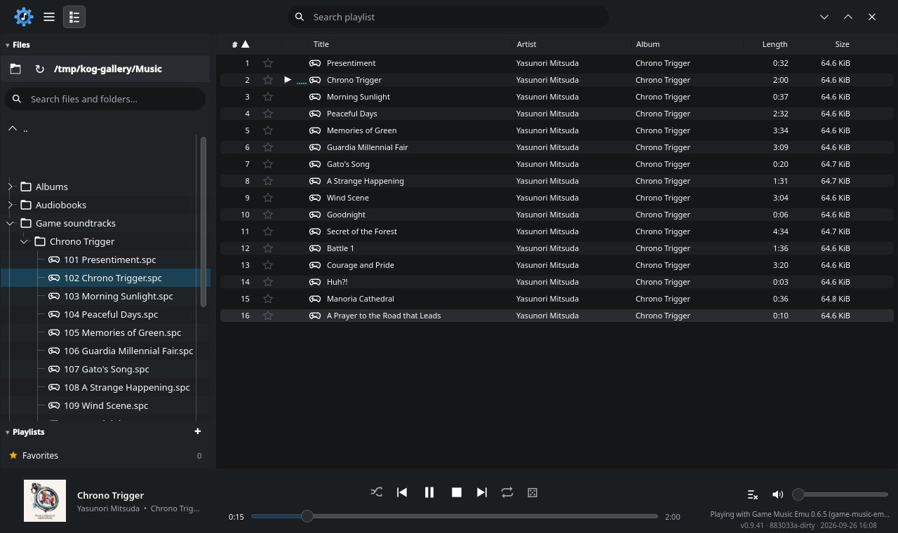
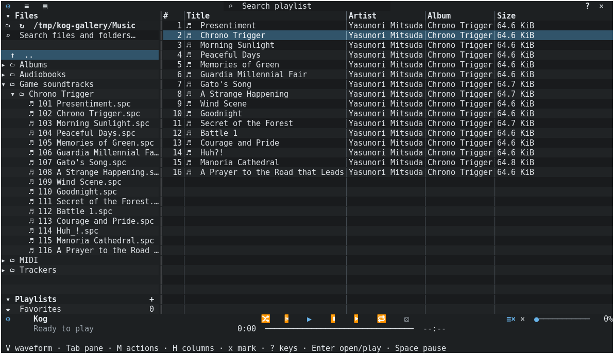
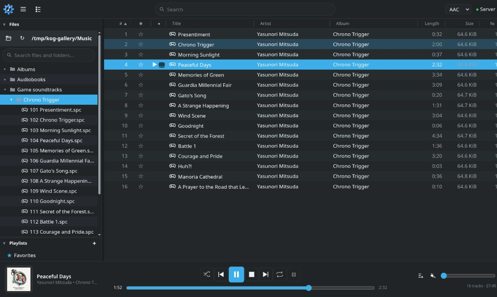
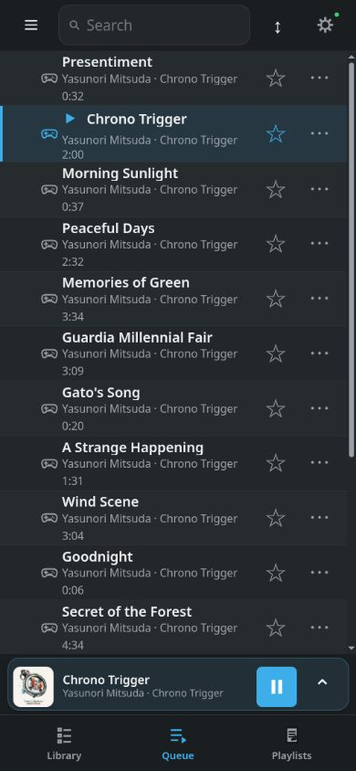
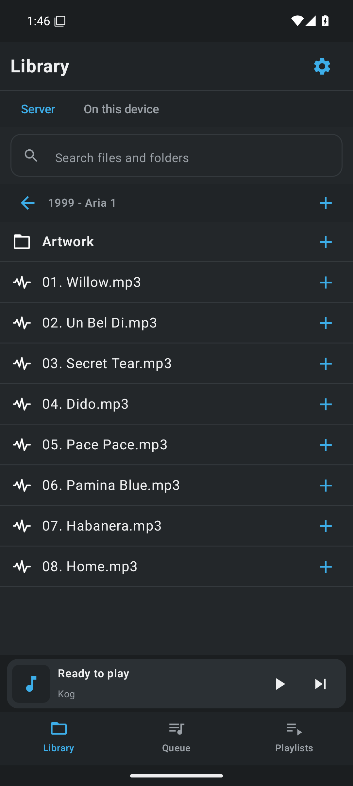

<p align="center">
  
</p>
<h1 align="center">Kog</h1>
<p align="center">Your music, from FLAC to chiptunes. On your desktop, in your terminal, or on your phone.</p>
<p align="center">
  <a href="https://github.com/benwbooth/Kog/releases/latest">Download</a> ·
  <a href="docs/USAGE.md">User guide</a> ·
  <a href="https://github.com/benwbooth/Kog/issues">Report a bug</a>
</p>

[](https://github.com/benwbooth/Kog/actions/workflows/packages.yml)
[](https://github.com/benwbooth/Kog/actions/workflows/android.yml)

Kog is a free, open-source music player inspired by [Cog](https://cog.losno.co/).
Play your albums, audiobooks, MIDI, tracker modules, and game soundtracks from
one library—even when the music lives inside an archive.

- **Browse your files.** Search folders and archives, build playlists, and save favorites.
- **Rediscover your collection.** Random Radio keeps music coming from the folder you choose.
- **Hear unusual formats.** MP3, FLAC, Opus, MIDI, MOD/XM, SID, SPC, VGM, PSF, and many more. [Format details](docs/FORMAT_PARITY.md)
- **Listen around the house.** Run a Kog server and stream your library to a browser or phone, with an independent queue on each device.

## Pick your player

| Frontend | What you get |
| --- | --- |
| **Qt desktop** · Windows, Linux, Apple Silicon Mac | Full library and playlist panes, tag editing, equalizer, visualizers, mini-player, and Winamp skins. |
| **Terminal** · Linux, macOS | A familiar two-pane player with keyboard and mouse controls, resizable panes, artwork, and visualization. No Qt required. |
| **Web** · Desktop and mobile browsers | Your server's library in a browser, with a compact touch layout and home-screen support on phones. |
| **iPhone** · SwiftUI | A native app for server streaming and imported local files. [Build and install](ios/README.md) |
| **Android** · Kotlin/Compose | A native app with server streaming, local playback, and background media controls. [Build and install](android/README.md) |
| **Headless server** · Windows, Linux, macOS | Serve your library and the web player without opening a window. [Setup](docs/SERVER.md) |

The players share Rust audio and library code; each keeps its own playback
queue. Native mobile apps are still in development; their guides describe
installation and remaining limitations.

## See it in action

**Qt desktop**



<details>
<summary><strong>Terminal and desktop web</strong></summary>

**Terminal** — keyboard and mouse, straight from your shell.



**Web** — the same collection in your browser.



</details>

<p>
  
  &nbsp;
  
</p>
<p><em>Mobile web (left) and native Android (right).</em></p>

## Get started

[Download a desktop release](https://github.com/benwbooth/Kog/releases/latest):
**Windows** MSI or portable ZIP · **Apple Silicon Mac** DMG · **Linux** AppImage,
portable bundle, or Flatpak.

Separate **TUI** and **headless server** bundles are also available for Linux
and macOS on the release page.

For the newest features, download artifacts from a successful
[desktop build](https://github.com/benwbooth/Kog/actions/workflows/packages.yml).
Development Android APKs are available from successful
[Android builds](https://github.com/benwbooth/Kog/actions/workflows/android.yml).

Open Kog, choose your music folder, and add songs to the playlist. In a terminal:

```sh
kog --gui       # Desktop player
kog --tui       # Terminal player (Linux/macOS); press ? for help
kog --server    # Web player and API, using your saved server settings
```

Running `kog` in an interactive Unix terminal selects the TUI automatically.
For phone/browser access, enable the server in **Preferences → Server**, then
open its address. [Setup and authentication](docs/SERVER.md)

Packages include their decoder libraries. MIDI SoundFonts and Roland ROMs are
user supplied; [MIDI setup](docs/USAGE.md#midi-soundfonts-and-roland-emulation)
explains the options. Desktop packages are currently unsigned development
builds; macOS packages are ad-hoc signed, not notarized. Intel Macs are unsupported.

## More

[User guide](docs/USAGE.md) · [Build from source](docs/BUILDING.md) ·
[Architecture](docs/ARCHITECTURE.md) · [Skins and visualizers](docs/SKINS_AND_VISUALIZERS.md)

Kog-authored code is **GPL-3.0-or-later**. Third-party components and artwork
retain their own licenses. [License policy](docs/LICENSING.md) ·
[Third-party notices](THIRD_PARTY_NOTICES.md)
